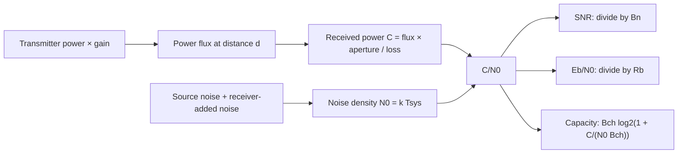

# RF power, noise, and capacity

[Guide index and notation](README.md) · [Energy and BER](physics-communications.md)

This guide follows a signal from a transmitter to an input-referred receiver
model. It derives the equations used by `Transmitter`, `PathLoss`, `Receiver`,
`LinkBudget`, `pfd`, and `PhyRate`. The receiver input is the reference plane
for both signal power and noise temperature.



## Power ratios and reference units

For a power ratio `x`, its decibel value is `10 log10(x)`. Multiplication of
linear gains therefore becomes addition in dB; division by a linear loss
becomes subtraction. Absolute power needs a reference:

```text
P_dBW = 10 log10(P / 1 W)
P_dBm = 10 log10(P / 1 mW) = P_dBW + 30
```

The factor 20 applies to an amplitude ratio only when power is proportional
to its square under the same impedance or normalization. A linear SNR of 10
is 10 dB, not 20 dB. `PhyRate.snr` accepts the linear ratio.

## From EIRP to received power

Let `Pt` be transmitter power in watts and `Gt` its directional antenna gain
relative to isotropic. By definition, `EIRP = Pt * Gt`. Thus
`Transmitter::eirp_dbm()` adds output power in dBm and gain in dBi.

Power flowing through a far-field sphere spreads over area `4 pi d²`.
The flux in the receiver direction and the effective receive aperture are:

```text
S = EIRP / (4 pi d²)              [W/m²]
Ae = Gr lambda² / (4 pi)          [m²]
C = S Ae / L
  = Pt Gt Gr / L * (lambda / (4 pi d))²  [W]
```

Here `lambda = c/f`, `Gr` is receive gain, and `L` is any additional linear
loss. The aperture relation requires matched polarization and the appropriate
antenna gain and impedance convention. These are the spreading and aperture
relations behind [ITU-R P.525-5, equations 3–5](https://www.itu.int/dms_pubrec/itu-r/rec/p/R-REC-P.525-5-202411-I%21%21PDF-E.pdf).

For unit isotropic gains, the inverse power ratio defines free-space loss:

```text
Lfs = (4 pi d / lambda)²
Lfs_dB = 20 log10(4 pi d / lambda)
C_dBm = EIRP_dBm - Lfs_dB - L_dB + Gr_dBi
```

This is `PathLoss::calculate()` followed by `LinkBudget::pin_at_receiver()`.
The input frequency and distance must be positive. The geometry must be in
the antenna far field. The model does not include obstruction, multipath,
polarization mismatch, or atmospheric loss unless an appropriate loss is
supplied separately.

For fixed EIRP, vacuum power flux has no frequency term. The wavelength term
appears when converting flux to received power with a specified antenna gain.
Holding a physical aperture fixed while changing frequency changes antenna
gain too. Thus the frequency scaling depends on what is held fixed.

`power_flux_density_dbw_per_m2()` returns the logarithm of `S`. For a flat
spectrum of total width `B_MHz`, power density per MHz is `S / B_MHz`.
`pfd_per_mhz()` therefore subtracts `10 log10(B_MHz)`. The argument is in MHz,
not Hz. This is an average spectral density, not a prediction of a spectral
peak or a regulatory measurement in a particular filter.

## Why thermal noise is kTB

In the classical thermal regime, a resistance `R` at temperature `T` has
open-circuit mean-square noise voltage `4 k T R Bn`. A matched load divides
that voltage by two, so its mean-square voltage is one quarter as large.
The delivered noise power is consequently:

```text
N = (4 k T R Bn) / (4 R) = k T Bn
N0 = N / Bn = k T
```

This uses available noise power with a matched source, not arbitrary voltage
noise across an arbitrary load. The temperature can be an equivalent noise
temperature; it need not equal the physical temperature of every component.
[Keysight's noise measurement model](https://helpfiles.keysight.com/csg/pxivna/Applications/Noise_Figure.htm)
uses this available-power convention and distinguishes it from incident power.

`k = 1.380649e-23 J/K` and `c = 299792458 m/s` are
[SI defining constants](https://www.bipm.org/en/measurement-units/si-defining-constants).
Since `J * Hz = W`, `k T Bn` has units of watts. A filter's equivalent noise
bandwidth is the width of a rectangular filter with the same integrated
noise and reference gain. It is not generally the filter's 3 dB width or the
waveform's occupied bandwidth.

## Why noise figure adds a temperature

Noise figure describes an SNR degradation at the standard source temperature
`T0 = 290 K`. Let `Ga` be receiver power gain and `Na` its added output noise.
At that reference temperature, the definition gives:

```text
F = SNR_in / SNR_out
  = [C / (k T0 Bn)] / [Ga C / (Ga k T0 Bn + Na)]
  = 1 + Na / (Ga k T0 Bn)
```

Define the input-referred added temperature `Te = Na / (Ga k Bn)`. Solving
the definition gives `Te = T0 (F - 1)`, with `F = 10^(NF/10)`.
This is the noise-factor model described in
[Keysight's noise-figure fundamentals](https://www.keysight.com/us/en/assets/7018-06808/application-notes/5952-8255.pdf).

Independent source and receiver noise powers add. At a common input plane:

```text
Tsys = Tsource + Te = Tsource + 290 (F - 1)
N0 = k Tsys
N = k Tsys Bn
```

Multiplying `Tsource` by `F` instead gives the same result only if
`(F - 1)(Tsource - T0) = 0`. A 290 K source is one such case; a noiseless
receiver with `F = 1` is another.

For a 50 K source and `F = 2`, `Te = 290 K` and `Tsys = 340 K`.
The incorrect product `50 * 2` gives 100 K. It understates noise by
`10 log10(340/100) = 5.314789 dB`.

Choose `ReceiverNoise::SourceAndNoiseFigure` when these two contributions are
known separately. Choose `SystemTemperature` when the supplied temperature
already includes both. Adding NF to an already total temperature counts
receiver-added noise twice. An equivalent receiver temperature `Te` alone
still needs the source contribution.

The input plane matters. Moving across a lossy feed changes both signal and
noise. Include its attenuation and thermal contribution consistently before
passing gain and temperature to this model. The crate does not infer them
from a feed network. `calculate_noise_floor()` and `calculate_noise_power()`
both return total input-referred noise in dBm.

## G/T, SNR, and C/No are the same accounting

Divide received signal power by `N0 = k Tsys`. Combining the earlier link
equation with that division gives:

```text
C/N0 = Pt Gt Gr / (Lfs L k Tsys)                 [Hz]
G/T_dB/K = Gr_dBi - 10 log10(Tsys / 1 K)
(C/N0)_dBHz = EIRP_dBW - Lfs_dB - L_dB + G/T_dB/K - k_dB
k_dB = 10 log10(k / (1 W/(K Hz))) = -228.599167...
```

EIRP must be in dBW in this last equation. Substituting dBm introduces a
30 dB error. `Receiver::g_over_t_db()` must use the same `Tsys` as noise power
for this identity to hold.

Alternatively, integrate noise first and then divide:

```text
SNR = C / (N0 Bn)
(C/N0)_dBHz = SNR_dB + 10 log10(Bn / 1 Hz)
```

This second path is `LinkBudget::c_over_no()`. Increasing only `Bn` lowers
measured SNR but leaves C/No fixed if all signal power is still captured and
the noise density is flat. The same distinction is needed for
[energy per bit](physics-communications.md).

## Why capacity uses channel bandwidth

For a scalar Gaussian channel `Y = X + Z`, mutual information is
`h(Y) - h(Z)`. With independent Gaussian signal and noise, their variances
add, and Gaussian differential entropy is `0.5 log2(2 pi e sigma²)`.
Subtracting the entropies gives `0.5 log2(1 + SNR)` bits per real degree of
freedom. An ideal band-limited channel has `2 Bch` real degrees of freedom
per second. Therefore:

```text
capacity = Bch log2(1 + SNR_channel)               [bit/s]
SNR_channel = C / (N0 Bch) = SNR_measured * Bn/Bch
```

Gaussian signaling maximizes the output entropy under an average-power
constraint. This supplies the bound; it is not a proof that a particular
modem reaches it. See
[Shannon, Theorem 17](https://people.math.harvard.edu/~ctm/home/text/others/shannon/entropy/entropy.pdf).

`LinkBudget::phy_rate()` obtains channel SNR from C/No and `Bch`.
`PhyRate` accepts the linear SNR directly, so callers constructing it must
use noise integrated over its `bandwidth`. Equal receiver and channel
bandwidths make the two SNR values equal.

The bound assumes flat additive white Gaussian noise, a flat channel, and
complete signal capture. It does not include filter clipping, finite
constellations, framing overhead, or decoder implementation loss.
`throughput_bps()` is a separate configured information rate under the
crate's symbol-rate assumption; that rate is not guaranteed to close the link.

## Worked check: cold source and two noise bandwidths

Use `Tsource = 50 K`, `F = 2`, receive gain `40 dBi`, and `Bch = 20 MHz`.
Choose received power `C = k * 340 * 1e8 W = -93.284378 dBm`. Then
`C/N0 = 1e8 Hz = 80 dB-Hz` and `G/T = 14.685211 dB/K`.

| Quantity | `Bn = 30 MHz` | `Bn = 60 MHz` |
| --- | --- | --- |
| `Tsys` | 340 K | 340 K |
| Integrated noise | -98.513165 dBm | -95.502865 dBm |
| Measured SNR | 5.228787 dB | 2.218487 dB |
| C/No | 80 dB-Hz | 80 dB-Hz |
| Channel SNR | 5 linear | 5 linear |
| Ideal capacity | 51.699250 Mbit/s | 51.699250 Mbit/s |

Noise doubles in the wider receiver bandwidth. Neither received signal
power nor noise density changes. Both noise bandwidths exceed channel width;
the example does not claim that narrowing a real filter below the signal
bandwidth preserves signal energy.

## Implementation and verification map

| Calculation | Implementation | Existing evidence |
| --- | --- | --- |
| EIRP and power references | [transmitter.rs](../src/transmitter.rs) | `eirp_dbm_dbw_consistency`, `zero_gain_eirp_equals_power` |
| Spreading and aperture | [path_loss.rs](../src/path_loss.rs), [pfd.rs](../src/pfd.rs) | `pfd_inverse_square_law`; independent aperture calculation in `receiver_physics` |
| Total temperature and kTB | [receiver.rs](../src/receiver.rs) | `standard_source_recovers_noise_factor_scaling`, `zero_source_still_has_receiver_added_noise` |
| G/T and C/No consistency | [budget.rs](../src/budget.rs) | `cold_source_matches_kt_noise_and_g_over_t_link_equation` |
| Equivalent noise inputs | [receiver_physics.rs](../tests/receiver_physics.rs) | `equivalent_receiver_descriptions_produce_the_same_link` |
| Channel capacity | [phy.rs](../src/phy.rs), [budget.rs](../src/budget.rs) | `capacity_uses_channel_bandwidth_when_noise_bandwidth_differs`, `capacity_preserves_equal_bandwidth_result` |

The integration oracle uses SI constants and spherical spreading with
effective aperture, without calling the production RF conversion helpers.
Its floating-point tolerances check arithmetic agreement. They do not express
uncertainty in antenna gain, atmospheric loss, or a measured noise temperature.
